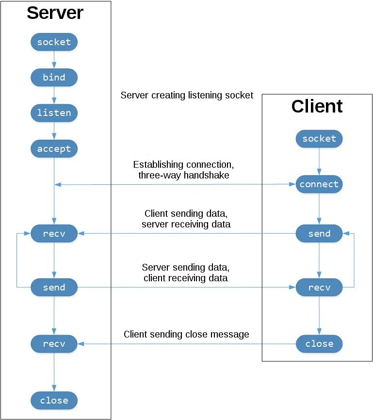
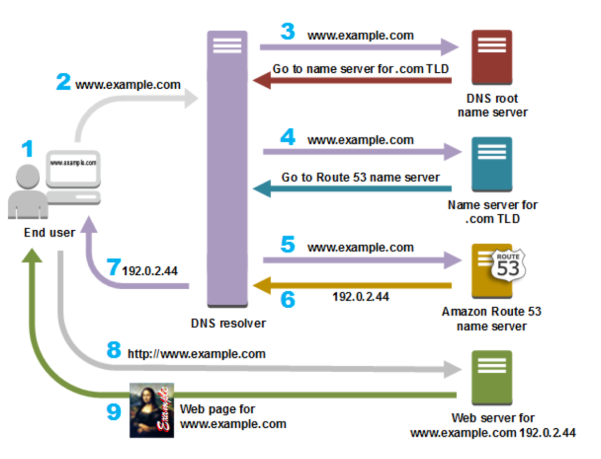
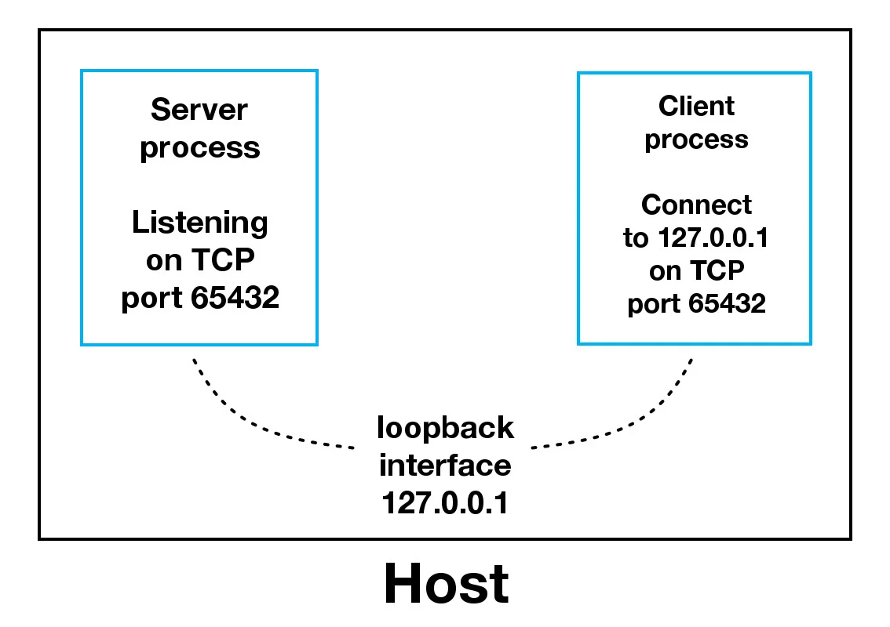
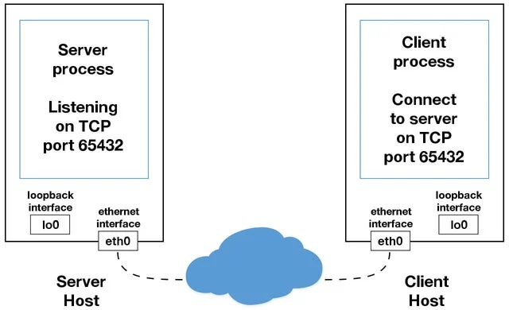

# Socket programming in Python
## Back ground
Socket có một lịch sử lâu dài. Việc sử dụng chúng bắt nguồn từ ARPANET vào năm 1971 và sau đó trở thành API trong hệ điều hành Phân phối phần mềm Berkeley (BSD) được phát hành năm 1983 được gọi là ổ cắm Berkeley.
Khi internet bắt đầu phát triển vào năm 1990 với World Wide Web, lập trình mạng cũng vậy. Máy chủ web và trình duyệt không phải là ứng dụng duy nhất tận dụng các mạng mới được kết nối và sử dụng ổ cắm. Các ứng dụng máy khách-máy chủ thuộc mọi loại và kích cỡ đã được sử dụng rộng rãi.
Ngày nay, mặc dù các giao thức cơ bản được API socket sử dụng đã phát triển qua nhiều năm và các giao thức mới đã phát triển, nhưng API cấp thấp vẫn được giữ nguyên.
Loại ứng dụng socket phổ biến nhất là ứng dụng client-server, trong đó một bên đóng vai trò là máy chủ và chờ kết nối từ máy khách. Đây là loại ứng dụng mà tôi sẽ tạo trong phần tiếp theo. Cụ thể hơn, bạn sẽ tập trung vào API socket cho ổ cắm Internet, đôi khi được gọi là ổ cắm Berkeley hoặc BSD. Ngoài ra còn có các ổ cắm tên miền Unix, chỉ có thể được sử dụng để liên lạc giữa các tiến trình trên cùng một máy chủ..

## Socket API OVerview
Các hàm và phương thức API socket chính trong bài này là:
- socket()
- .bind()
- .listen()
- .accept()
- .connect()
- .connect_ex()
- .send()
- .recv()
- .close()

## TCP socket
Chúng ta sẽ tạo một socket sử dụng socket.socket(), chỉ định loại socket là SOCK_STREAM. Khi làm điều này, giao thức mặc định được sử dụng là giao thức TCP. 
Tại sao lại dùng TCP?
- Đáng tin cậy: Các gói tin bị drop được người gửi phát hiện và truyền lại
- Có phân phối dữ liệu theo thứ tự: Dữ liệu được ứng dụng đọc theo thứ tự được người gửi viết.
Các thiết bị mạng, chẳng hạn như router và bộ chuyển mạch(switches), có sẵn băng thông hữu hạn và đi kèm với những hạn chế hệ thống cố hữu của riêng chúng. Chúng có CPU, bộ nhớ, bus và bộ đệm gói giao diện, giống như máy khách và máy chủ của bạn. TCP giúp chúng ta không phải lo lắng về việc mất gói, dữ liệu đến không đúng thứ tự và các cạm bẫy khác luôn xảy ra khi ta giao tiếp qua mạng.
Ngược lại, UDP socket được tạo bằng socket.SOCK_DGRAM không đáng tin cậy và dữ liệu mà người nhận đọc có thể không đúng thứ tự so với ghi của người gửi.
Để hiểu rõ hơn về điều này, hãy xem chuỗi lệnh gọi API socket() và luồng dữ liệu cho TCP:


Cột bên trái đại diện cho máy chủ, cột bên phải đại diện cho máy khách.

Bắt đầu từ cột trên cùng bên trái, hãy lưu ý các lệnh gọi API mà máy chủ thực hiện để thiết lập "listen" socket:
- socket()
- .bind()
- .listen()
- .accept()

Listen socket lắng nghe các kết nối từ phía clients. 
Máy khách gọi `connect()` để thiết lập kết nối với máy chủ và thiết lập bắt tay ba bước. Bước bắt tay này rất quan trọng vì nó đảm bảo rằng mỗi bên của kết nối đều có thể truy cập được trong mạng, nói cách khác là máy khách có thể truy cập được máy chủ và ngược lại.    
Khi có clients kết nối, máy chủ sẽ gọi `accept()` để chấp nhận kết nối.
Sau đó client và server trao đổi thông tin bằng `send()` và `recv()`
Cuối cùng thì client và server gọi `close()`

## Echo Client and Server
Bây giờ chúng ta đã có cái nhìn tổng quan về API socket cũng như cách máy khách và máy chủ giao tiếp với nhau, thử tạo máy khách và máy chủ đầu tiên của mình. Ta sẽ bắt đầu với việc triển khai đơn giản. Máy chủ sẽ chỉ lặp lại bất cứ điều gì nó nhận được cho máy khách.
### Echo server
```py
import socket
HOST = "127.0.0.1" #local host
PORT = 65432   # Port to listen on (non-privileged ports are > 1023)
with socket.socket(socket.AF_INET, socket.SOCK_STREAM) as s:
    s.bind((HOST,PORT))
    s.listen()
    conn, addr = s.accept()
    with conn:
        print(f"Connected by {addr}")
        while True:
            data = conn.recv(1024)
            if not data:
                break
        conn.sendall(data)
```

OK, vậy chuyện gì đang xảy ra phía dưới các cuộc gọi API
`socket.socket()` tạo một socket hỗ trợ context manager type, do đó chúng ta có sử dụng nó với `with` và không cần thiết phải gọi `s.close()`
```py
with socket.socket(socket.AF_INET, socket.SOCK_STREAM) as s:
    pass  # Use the socket object without calling s.close().
```
Các đối số được truyền cho `socket()` là các hằng số được sử dụng để chỉ định họ địa chỉ và loại ổ cắm. `AF_INET` là họ địa chỉ Internet cho `IPv4`. `SOCK_STREAM` là loại ổ cắm cho `TCP`, giao thức sẽ được sử dụng để truyền tải tin nhắn trong mạng.
Phương thức `.bind()` được sử dụng để liên kết ổ cắm với giao diện mạng và số cổng cụ thể

```py
# echo-server.py

# ...

with socket.socket(socket.AF_INET, socket.SOCK_STREAM) as s:
    s.bind((HOST, PORT))
    # ...
```

Các giá trị được truyền cho `bind()` phụ thuộc vào họ địa chỉ của socket. Trong ví dụ này, bạn đang sử dụng socket.AF_INET (IPv4). Vì vậy, nó mong đợi một cặp: (host, port).
- host có thể là tên máy chủ, địa chỉ IP hoặc một xâu rỗng. Nếu địa chỉ IP được sử dụng, máy chủ phải là chuỗi địa chỉ có định dạng IPv4. Địa chỉ IP 127.0.0.1 là địa chỉ IPv4 tiêu chuẩn cho giao diện loopback, do đó chỉ các tiến trình trên máy mới có thể kết nối với máy chủ. Nếu chúng ta truyền vào một xâu rỗng, máy chủ sẽ chấp nhận kết nối trên tất cả các giao diện IPv4 có sẵn.
- port đại diện cho sốc cổng TCP. Nó phải là 1 số nguyên từ 1 đến 65535, vì số 0 được đặt trước. Một số hệ thông sẽ yêu cầu đặc quyền từ superuser nếu có cổng nhỏ hơn 1024.
Sau đây là lưu ý về cách sử dụng tên máy chủ với .bind():
> "If you use a hostname in the host portion of IPv4/v6 socket address, the program may show a non-deterministic behavior, as Python uses the first address returned from the DNS resolution. The socket address will be resolved differently into an actual IPv4/v6 address, depending on the results from DNS resolution and/or the host configuration. For deterministic behavior use a numeric address in host portion.”

DNS resolver:


Hiện tại, chỉ cần hiểu rằng khi sử dụng tên máy chủ, ta có thể thấy các kết quả khác nhau tùy thuộc vào nội dung được trả về từ quá trình phân giải tên. Những kết quả này có thể là bất cứ điều gì. Lần đầu tiên chạy ứng dụng, ta có thể nhận được địa chỉ 10.1.2.3. Lần tiếp theo, bạn nhận được một địa chỉ khác, 192.168.0.1. Lần thứ ba, bạn có thể nhận được 172.16.7.8, v.v.

Phương thức .listen() có tham số `backlog`. Nó chỉ định số lượng kết nối không được chấp nhận mà hệ thống sẽ cho phép trước khi từ chối các kết nối mới. Bắt đầu từ Python 3.5, đây là tùy chọn. Nếu không được chỉ định, giá trị `backlog` mặc định sẽ được chọn.

Phương thức `accept()` chặn việc thực thi và chờ kết nối đến. Khi một máy khách kết nối, nó sẽ trả về một đối tượng socket mới biểu thị kết nối đó và một bộ dữ liệu chứa địa chỉ của máy khách. Bộ dữ liệu sẽ chứa (host, port)cho các kết nối IPv4 hoặc (host, port, flowinfo, scopeid) cho IPv6.
Một điều bắt buộc phải hiểu là bây giờ ta có một đối tượng socket mới từ .accept(). Điều này rất quan trọng vì đó là socket mà ta sẽ sử dụng để liên lạc với khách hàng. Nó khác với ổ cắm nghe mà máy chủ đang sử dụng để chấp nhận các kết nối mới
Phần còn lại chỉ là nhận và gửi thông tin thôi.

### Echo client
```py
#echoclient.py
import socket

HOST = "127.0.0.1"  # The server's hostname or IP address
PORT = 65432  # The port used by the server

with socket.socket(socket.AF_INET, socket.SOCK_STREAM) as s:
    s.connect((HOST, PORT))
    s.sendall(b"Hello, world")
    data = s.recv(1024)

print(f"Received {data!r}")
```
So với máy chủ, máy khách khá đơn giản. Nó tạo một đối tượng socket, sử dụng .connect() để kết nối với máy chủ và gọi s.sendall() để gửi tin nhắn của nó. Cuối cùng, nó gọi s.recv() để đọc phản hồi của máy chủ rồi in ra.

### Running the Echo Client and Server
Trong phần này, chúng ta sẽ chạy máy khách và máy chủ để xem cách chúng hoạt động và kiểm tra những gì đang xảy ra.

Client side:
```bash
PS D:\learn python\Socket programming in python> python3 .\echo_client.py
Client send: id
Client send: whoami
Client send: i hate people here
Client send: im so fucking stupid
Client send: stoooopid
Client send:
```

Server side:
```bash
PS D:\learn python\Socket programming in python> python3 .\echo_server.py
Connected by ('127.0.0.1', 51344)
Receive b'Hello, world'
Receive b'id'
Receive b'whoami '
Receive b'i hate people here'
Receive b'im so fucking stupid'
Receive b'stoooopid'
```

### Viewing socket state
Mở cmd với quyền admin ta có
```bash
C:\Windows\System32>netstat -ano | findstr "65432"
  TCP    127.0.0.1:49913        127.0.0.1:65432        ESTABLISHED     1796
  TCP    127.0.0.1:65432        0.0.0.0:0              LISTENING       16228
  TCP    127.0.0.1:65432        127.0.0.1:49913        ESTABLISHED     16228
```
với `127.0.0.1:49913` là foreign port.

### Communication breakdown
Bây giờ ta sẽ xem xét kĩ hơn cách client và server kết nối với nhau:


Khi sử dụng giao diện loopback (địa chỉ IPv4 127.0.0.1 hoặc địa chỉ IPv6 ::1), dữ liệu không bao giờ rời khỏi máy chủ hoặc chạm vào mạng bên ngoài. Trong sơ đồ trên, giao diện loopback được chứa bên trong máy chủ. Điều này thể hiện bản chất bên trong của giao diện loopback và cho thấy các kết nối và dữ liệu truyền qua nó là cục bộ đến máy chủ. Đây là lý do tại sao bạn cũng sẽ nghe thấy giao diện loopback và địa chỉ IP 127.0.0.1 hoặc ::1 được gọi là “localhost”.
Các ứng dụng sử dụng giao diện loopback để liên lạc với các tiến trình khác đang chạy trên máy chủ cũng như để bảo mật và cách ly với mạng bên ngoài. Bởi vì nó là nội bộ và chỉ có thể truy cập được từ bên trong máy chủ nên nó không bị lộ.
Ta có thể thấy điều này hoạt động nếu bạn có máy chủ của một ứng dụng sử dụng cơ sở dữ liệu riêng của nó. Nếu đó không phải là cơ sở dữ liệu được các máy chủ khác sử dụng thì có thể nó được định cấu hình để chỉ nghe các kết nối trên giao diện loopback. Trong trường hợp này, các máy chủ khác trên mạng không thể kết nối với nó.
Khi ta sử dụng địa chỉ IP khác `127.0.0.1` hoặc `::1` trong ứng dụng của mình, địa chỉ đó có thể bị ràng buộc với giao diện Ethernet được kết nối với mạng bên ngoài. Đây là cổng vào các máy chủ khác bên ngoài “localhost” của chúng ta. Hãy cẩn thận bên ngoài đó. Chả hay ho gì đâu.


## Handling Multiple Connections
Echo server chắc chắn có các hạn chế của nó. Vấn đề lớn nhất là nó chỉ phục vụ một client rồi thoát ra. Máy client echo cũng có hạn chế này. Ngoài ra còn có thêm một vấn đề khác nữa. Đấy là khi máy khách sử dụng `s.recv()` thì nó chỉ có thể trả về 1 byte mà thôi.
```py
# echo-client.py

# ...

with socket.socket(socket.AF_INET, socket.SOCK_STREAM) as s:
    s.connect((HOST, PORT))
    s.sendall(b"Hello, world")
    data = s.recv(1024)

print(f"Received {data!r}")
```
`data = s.recv(1024)`. Đối số 1024 ở đây là số kí tự tối đa có thể nhận được trong cùng một lúc. 
Ừm... điều này không có nghĩa là recv() sẽ trả về 1024 kí tự.
Phương thức `send()` cũng hoạt động theo cách này. Nó trả về số byte đã gửi. Có thể nhỏ hơn kích thước của dữ liệu được truyền vào.
> “Applications are responsible for checking that all data has been sent; if only some of the data was transmitted, the application needs to attempt delivery of the remaining data.”

Trong ví dụ bên trên, chúng ta xử lí chuyện này với hàm `sendall()`.
> “Unlike send(), this method continues to send data from bytes until either all data has been sent or an error occurs. None is returned on success.”

Tóm lại ở đây chúng ta có 2 vấn đề:
- Làm thế nào để xử lí nhiều kết nối đồng thời.
- Ta cần gọi .send() và .recv() cho đến khi tất cả dữ liệu được gửi hoặc nhận.

Chúng ta có thể làm gì?
Có nhiều cách để xử lí vấn đề này. Có một cách tiếp cận phổ biến là sử dụng I/O không đồng bộ. `asyncio` được đưa vào thư viện chuẩn trong Python 3.4. Cách khác là sử dụng thread.

Trong ví dụ này chúng ta sẽ xử lí sử dụng system calls: `select()`
Phương thức `select()` cho phép chúng ta kiểm tra sự hoàn thành của I/O trên nhiều socket. Vì vậy, ta có thể gọi `select()` để xem socket nào có sẵn I/O sẵn sàng cho việc đọc và ghi.  